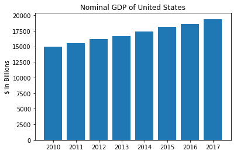
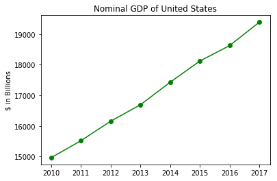

# Lab 1
Contents
```
-charts.ipynb
-barchart.png
-linegraph.png

-friends.ipynb
```

# Part I

## Bar Chart from charts.py


## Line Graph from charts.py


# Part II

Sample Output from num_friends()

```
Hero has 2 friend(s).
Klein has 1 friend(s).
```

Sample Output from
```
Dunn has 3 friend(s).
Sue has 3 friend(s).
Chi has 3 friend(s).
Hicks has 3 friend(s).
Kate has 3 friend(s).
Hero has 2 friend(s).
Thor has 2 friend(s).
Clive has 2 friend(s).
Devin has 2 friend(s).
Klein has 1 friend(s).
```
